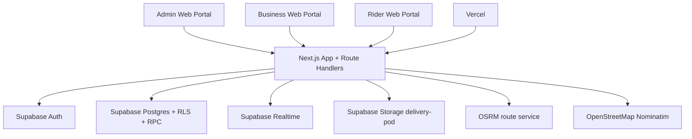
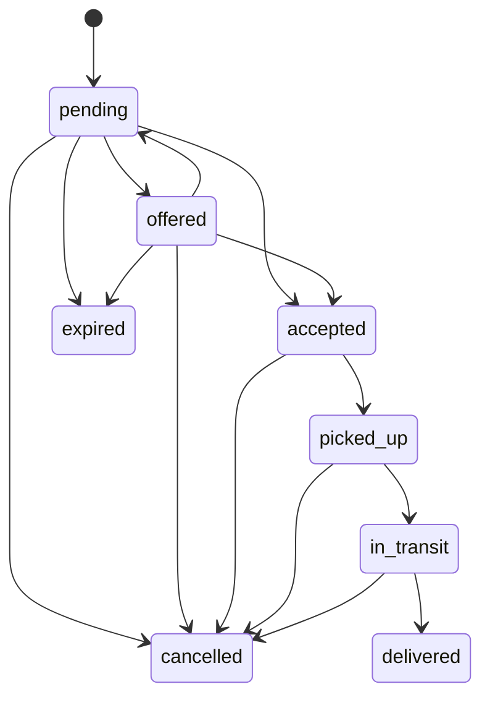
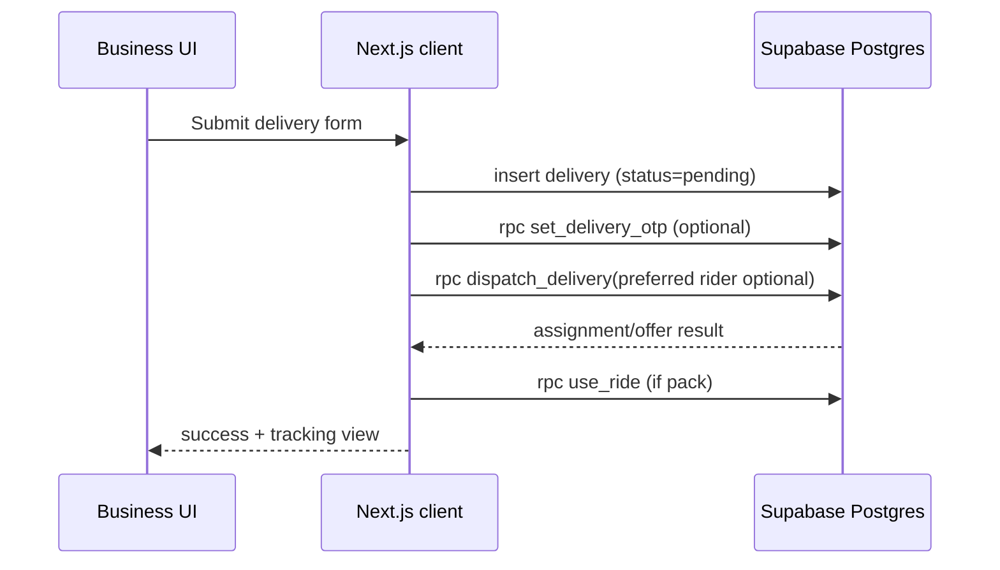
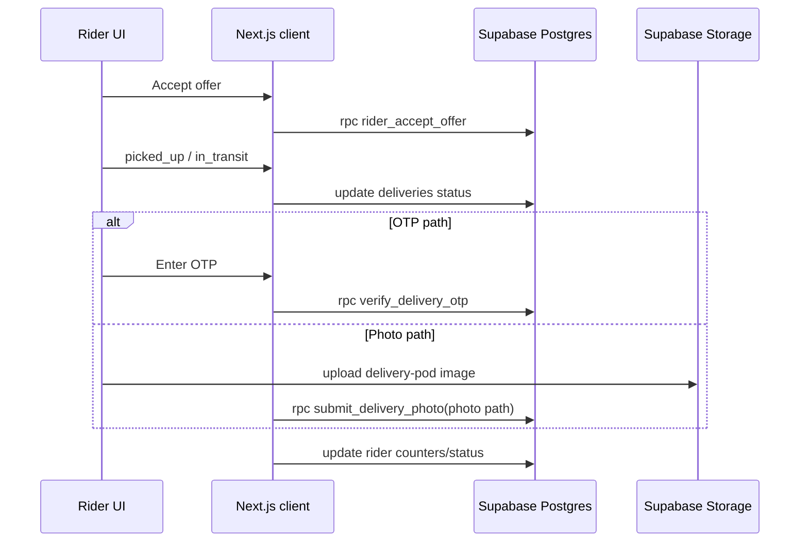
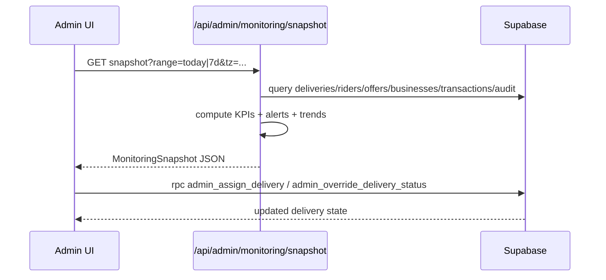

# The 1000 Architecture (CTO Onboarding)

Last updated: 2026-03-05
Codebase snapshot: `main` in `/mnt/c/Users/HP/Desktop/lovable/The1`

## 1) Executive Summary

The 1000 is a multi-portal B2B courier platform for Tangier, Morocco, built as a **Next.js App Router frontend + API layer** on top of **Supabase**.

Architecture style is a pragmatic hybrid:
- Client-heavy app logic in React pages and `lib/storage.ts` (direct Supabase queries/RPC).
- Server-side API routes for privileged operations (admin APIs, monitoring aggregation, routing proxy, rider status endpoint).
- Core business invariants enforced in Postgres via RLS policies, RPCs, and triggers.

Primary roles:
- `admin`: live ops, incident handling, user provisioning, wallet/location controls.
- `business`: creates deliveries, dispatches riders, tracks status and map.
- `rider`: online presence, receives offers, executes fulfillment, PoD.

## 2) System Context

## 3) Codebase Topology

### 3.1 Runtime Surfaces

- UI routes (`app/*`):
  - `/` marketing + portal entry (`app/page.tsx`)
  - `/admin`, `/business`, `/rider` login pages
  - `/admin/dashboard`, `/business/dashboard`, `/rider/dashboard`
  - `/admin/users` admin user management
- API routes (`app/api/*`):
  - Admin users CRUD/ops
  - Admin monitoring snapshot
  - Rider status update
  - Navigation route proxy
- Shared client service layer:
  - `lib/storage.ts` (user/business/rider/delivery/transaction services)
- Server auth/privilege helpers:
  - `lib/admin/auth.ts`, `lib/admin/audit.ts`, `lib/supabase/admin.ts`
- Monitoring compute layer:
  - `lib/admin/monitoring/types.ts`, `lib/admin/monitoring/compute.ts`
- Mapping and geospatial:
  - `components/maps/*`, `lib/navigation/osrm.ts`, `lib/geocode.ts`
- DB schema/migrations:
  - `supabase/migrations/*.sql`

### 3.2 Route Protection

`proxy.ts` acts as middleware guard for protected role routes:
- `/admin/*` requires admin
- `/business/*` requires business
- `/rider/*` requires rider

It validates Supabase session and profile role, then redirects mismatches.

## 4) Runtime Architecture Layers

### 4.1 Presentation Layer (React + App Router)

Dashboards are client components with:
- Realtime subscriptions (`supabase.channel(...).on('postgres_changes', ...)`)
- Safety polling intervals
- Action handlers calling either:
  - direct `lib/storage` methods (Supabase table/RPC calls), or
  - internal API routes for privileged logic.

### 4.2 Application Service Layer (`lib/storage.ts`)

Domain services:
- `userService`
- `businessService`
- `riderService`
- `deliveryService`
- `transactionService`

The service layer wraps:
- table CRUD
- RPC invocations (`dispatch_delivery`, `set_delivery_otp`, etc.)
- fallback behavior if some RPCs are missing (legacy/migration tolerance)

### 4.3 BFF/API Layer (Next.js Route Handlers)

Used where server-side control is required:
- admin-only user management (`/api/admin/users/*`)
- monitoring snapshot aggregation (`/api/admin/monitoring/snapshot`)
- rider status update with robust auth fallback (`/api/rider/status`)
- route proxy with cache/rate-limit (`/api/navigation/route`)

### 4.4 Data/Policy Layer (Supabase Postgres)

Business rules are centralized in SQL:
- RLS per table/role
- status transition guards via triggers
- mutable-vs-immutable delivery enforcement
- privileged admin safety-net RPCs
- audit tables (`admin_audit_logs`)

## 5) Domain Model

Core entities:
- `profiles` (identity + app role)
- `user_roles` (canonical role map)
- `businesses`
- `riders`
- `deliveries`
- `delivery_offers`
- `transactions`
- `rider_locations`
- `admin_audit_logs`

### 5.1 Delivery State Machine

Status taxonomy in code/types includes:
`pending | offered | accepted | picked_up | in_transit | delivered | cancelled | expired`

### 5.2 Payment Modes

Delivery `payment_method` supports:
`subscription | wallet | pack | payg | cod`

Pricing helpers exist in `lib/types.ts` and business UI chooses mode at creation time.

## 6) Key Flow Sequences

### 6.1 Business Creates and Dispatches Delivery

### 6.2 Rider Fulfillment + PoD

### 6.3 Admin Incident Intervention

## 7) Security Model

### 7.1 Authentication

- Supabase Auth for identity/session.
- Browser client (`@supabase/ssr`) used in frontend and route guard.

### 7.2 Authorization

- App-side role checks in login flows and dashboards.
- Route-level guard in `proxy.ts`.
- API-level guard in `requireAdminRequest` for admin endpoints.
- Postgres RLS as final enforcement layer.

### 7.3 Privileged Access

- `SUPABASE_SERVICE_ROLE_KEY` only used in server context (`lib/supabase/admin.ts`) for admin user management APIs.
- Admin actions are audit-logged via `admin_audit_logs` (non-fatal logging design).

## 8) Monitoring Architecture (Admin Dashboard V2)

Endpoint: `GET /api/admin/monitoring/snapshot`
- Query params:
  - `range=today|7d` (default `today`)
  - `tz` (default/fallback `Africa/Casablanca`)

Snapshot includes:
- KPI strip (incidents, active deliveries, online riders, dispatch rate, p50 accept, cash-in)
- alert queue with severities (`high|medium|low`)
- funnel counts
- trends (hour/day buckets)
- rider health
- business watch (low wallet, renewal due)
- recent admin audit feed

Alert rules implemented in `lib/admin/monitoring/compute.ts`:
- `pending_unassigned` (>120s)
- `offer_timeout` (>30s without accept)
- `rider_stale` (>5m heartbeat)
- `transit_overdue` (estimate*1.5 + 5m)
- `pod_missing` (recent delivered without PoD)
- `cod_missing` (delivered COD missing collection timestamp)

Refresh model:
- snapshot poll every 15s
- realtime-triggered refresh with 800ms debounce
- stale banner + last good snapshot retained on failure

## 9) Realtime, Polling, and Presence

- Admin dashboard:
  - realtime tables: `riders`, `businesses`, `deliveries`, `delivery_offers`
  - poll: snapshot 15s, operational data 60s
- Business dashboard:
  - realtime tables: `deliveries`, `businesses`, `riders`
  - poll fallback: 60s
- Rider dashboard:
  - realtime tables: `deliveries`, `delivery_offers`, `riders`
  - presence heartbeat: 15s
  - poll fallback: 30s

## 10) Mapping and Geospatial Stack

## 10.1 Rendering

- Feature flag `NEXT_PUBLIC_MAP_3D_ENABLED`:
  - `true`: MapLibre (`Map3DBase`) + optional 3D buildings layer
  - `false`: Leaflet fallback maps in dashboards

## 10.2 Routing

- API: `/api/navigation/route`
- Provider: OSRM public API (`router.project-osrm.org`)
- Defenses:
  - in-memory cache (60s)
  - per-client rate limit (60 requests/min)
  - degraded response with Google Maps/Waze fallback links

## 10.3 Geocoding

- Client-side `lib/geocode.ts`
- Provider: OpenStreetMap Nominatim
- Tangier-biased viewbox + 5-minute in-memory cache

## 11) Database Evolution Highlights

Migrations indicate progressive hardening:
- base schema + RLS (`001`)
- subscription/wallet RPCs (`002`)
- profile/role reconciliation (`003`, `008`, `011`)
- dispatch offers and RPCs (`005`, `012`)
- PoD + COD completion guards (`006`, `007`, `010`, `019`, `025`, `027`)
- admin provisioning and audit (`008`, `011`, `022`)
- rider self-heal profile RPC (`015`)
- monitoring indexes (`028`)

Performance indexes for monitoring endpoint (`028`):
- `deliveries(created_at desc)`
- `deliveries(status, created_at desc)`
- `delivery_offers(status, offered_at desc)`
- `riders(last_seen_at desc)`
- `transactions(created_at desc)`

## 12) Deployment and Environment

Runtime platform: Vercel.

Required envs (core):
- `NEXT_PUBLIC_SUPABASE_URL`
- `NEXT_PUBLIC_SUPABASE_PUBLISHABLE_DEFAULT_KEY` (or `NEXT_PUBLIC_SUPABASE_ANON_KEY` fallback)
- `SUPABASE_SERVICE_ROLE_KEY` (admin APIs)

Map envs:
- `NEXT_PUBLIC_MAP_3D_ENABLED`
- `NEXT_PUBLIC_MAP_STYLE_URL` (optional)
- `NEXT_PUBLIC_MAPTILER_KEY` (optional)
- `NEXT_PUBLIC_MAP_DEFAULT_PITCH`
- `NEXT_PUBLIC_MAP_DEFAULT_BEARING`

## 13) Operational Tooling

Smoke and verification scripts in `scripts/`:
- `smoke-production.js`
- `test-admin-monitoring-snapshot.js`
- `test-admin-create-user.js`
- `test-admin-list-users.js`
- `test-wallet-guard.js`
- `test-pod-otp.js`
- `test-pod-photo.js`
- `test-cod.js`

## 14) Current Gaps / CTO Attention Items

1. RPC dependency drift risk.
- App calls `complete_delivery_direct` from `lib/storage.ts`, but this function is not defined in tracked migrations.
- Action: either add migration for it or remove dependency.

2. Migration safety.
- `026_reset_tracking_deliveries_counters.sql` is destructive (`TRUNCATE` deliveries/offers/history).
- Action: enforce environment guard or archive as manual runbook script.

3. Mixed architecture (direct client DB access + API BFF).
- Functional today, but policy surface is split between frontend service calls and API routes.
- Action: decide long-term boundary (thin client + stronger BFF, or keep hybrid).

4. External provider resilience.
- OSRM/Nominatim are public services; failures are handled but still external dependency.
- Action: consider managed routing/geocoding SLA strategy if scale grows.

5. Observability depth.
- Operational monitoring is UI-facing snapshot, but server observability/log aggregation is minimal.
- Action: add structured logs + endpoint latency/error dashboards.

## 15) Suggested 30-Day CTO Plan

1. Lock DB contract.
- Reconcile all runtime RPCs with migration history.
- Add missing migrations and rollback notes.

2. Stabilize integration boundaries.
- Document which operations are allowed direct from client vs API-only.
- Move sensitive writes to API if needed.

3. Harden production operations.
- Add alerting on failed dispatch, stale rider heartbeat rates, snapshot API errors.
- Add safe migration checklist and prod change approvals.

4. Performance baseline.
- Measure snapshot endpoint p95 under seeded load.
- Measure realtime burst behavior and dashboard render cost.

5. Security/compliance pass.
- Validate RLS policies against all role permutations.
- Validate service-role key exposure boundaries in build/runtime.

---

If this document is used as the onboarding source of truth, keep it updated whenever any of the following changes:
- SQL migration that alters status/payment/auth behavior.
- API contract changes in `app/api/*`.
- Realtime/polling strategy changes in dashboards.
- Deployment/env model changes.
