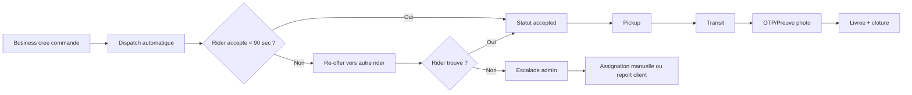
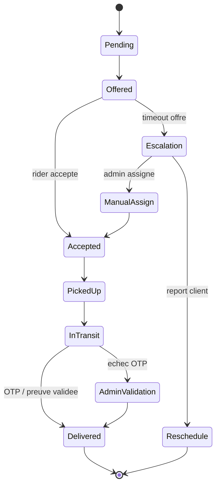

# Operations & workflow de bout en bout

## 1) Flux standard (E2E)

1. Le commerce cree une livraison (`/business/dashboard`).
2. Le systeme lance le dispatch vers riders disponibles.
3. Un rider accepte l'offre (`/rider/dashboard`).
4. Rider arrive pickup -> statut `picked_up`.
5. Verification livraison (OTP si active) + preuve photo.
6. Statut `delivered`, historisation transactionnelle.
7. Dashboard admin suit SLA/KPI en temps reel (`/admin/dashboard`).

## 2) Diagramme de workflow (Mermaid)

Source fichier: `funding-dossier/Diagrams/workflow.mmd`.

## Diagramme fallback incident (Mermaid)

## 3) Process anti-echec (failure-proof fallback)

## A. Aucun rider disponible
- Regle 1: re-offer automatique en boucle courte.
- Regle 2: escalade admin a T+3 min.
- Regle 3: choix force admin: reassignation, report client, annulation tracee.

## B. Rider ne se presente pas au pickup
- Timeout pickup defini (ex: 10 min).
- Reallocation immediate au rider suivant.
- Tag incident pour scoring qualite rider.

## C. Echec OTP / preuve de livraison
- Tentative OTP n°2.
- En cas d'echec persistant: validation admin sur preuve alternative (photo + appel client).
- Tous les overrides sont journalises (audit).

## D. Incident app/reseau
- Procédure degradee: hotline operationnelle + feuille de suivi temporaire.
- Reconciliation manuelle des statuts sous 2 heures max apres retour systeme.

## E. Gestion COD (si active)
- Encaissement trace par delivery ID.
- Remise codifiee fin de shift (ticket + signature).
- Reconciliation quotidienne admin (ecarts, justificatifs, blocage preventif si anomalie).

## 4) KPI operationnels obligatoires

| KPI | Cible M3 |
|---|---:|
| Temps creation -> acceptation | <= 3 min |
| Temps pickup -> dropoff median | <= 35 min |
| Taux de succes livraison | >= 95% |
| Taux annulation | <= 5% |
| Livraisons par rider actif/jour | >= 15 |

## 5) Controle interne (angle banque)

- Separation des roles: business / rider / admin.
- Journalisation des actions critiques (assignation, override statut, wallet).
- Monitoring quotidien: volume, incidents, cash/COD, performance riders.
- Plan de continuité simplifie (mode degrade et reconciliation).
