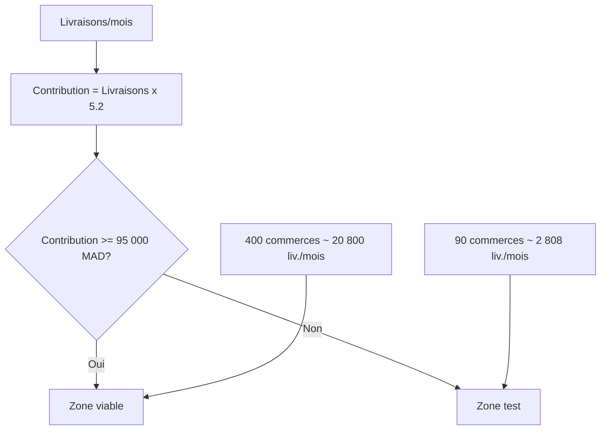

# Unit economics & seuil de viabilite

## 1) Hypotheses de base

Hypotheses de calcul (conservatrices):

| Variable | Valeur | Source / logique |
|---|---:|---|
| Jours operationnels / mois | 26 | Exploitation urbaine 6j/7 |
| Prix moyen / livraison | 22 MAD | Mix abonnement, wallet, payg |
| Commission rider moyenne | 15 MAD | Tiers app: 14-17 MAD |
| Couts variables plateforme | 1,8 MAD | Support, notifications, paiement, reserve incidents |
| Marge de contribution / livraison | 5,2 MAD | 22 - 15 - 1,8 |
| Couts fixes mensuels (phase M3) | 95 000 MAD | Team, ops, outils, admin |

## 2) Seuil rider (viabilite individuelle)

Rider AE cible: **15+ livraisons/jour**.

| Indicateur rider | A 15 livraisons/jour |
|---|---:|
| Revenu brut jour (15 MAD/liv.) | 225 MAD |
| Revenu brut mois (26j) | 5 850 MAD |
| Cout operation rider estime (carburant/maintenance/data) | ~1 300 MAD/mois |
| Revenu net avant cotisations/impots | ~4 550 MAD/mois |

Lecture:
- En dessous de 15 livraisons/jour, le revenu net rider devient moins attractif.
- Au-dessus de 15 livraisons/jour, retention rider et disponibilite horaire s'ameliorent.

## 3) Comparatif 90 commerces vs 400 commerces

## Hypotheses de volume
- Soft-launch 90 commerces: 1,2 livraison/commerce/jour.
- Cible soutenable 400 commerces: 2,0 livraisons/commerce/jour.

| KPI | 90 commerces (test) | 400 commerces (soutenable) |
|---|---:|---:|
| Livraisons/jour | 108 | 800 |
| Livraisons/mois | 2 808 | 20 800 |
| Riders actifs/jour requis (15 liv./j) | 7,2 | 53,3 |
| CA mensuel (22 MAD) | 61 776 MAD | 457 600 MAD |
| Commission riders (15 MAD) | 42 120 MAD | 312 000 MAD |
| Couts variables (1,8 MAD) | 5 054 MAD | 37 440 MAD |
| Marge de contribution | 14 602 MAD | 108 160 MAD |
| EBITDA apres fixes (95k) | -80 398 MAD | +13 160 MAD |

Conclusion:
- **90 commerces = phase test non soutenable seule**.
- **~350-400 commerces = zone de viabilite operationnelle**.

## 4) Seuil de rentabilite contribution

Formule:
- `Livraisons/mois break-even = Couts fixes / Marge par livraison`
- `= 95 000 / 5,2 = 18 269 livraisons/mois`

Equivalent journalier:
- `18 269 / 26 = 703 livraisons/jour`

Equivalent commerces actifs:
- A 2,0 livraisons/commerce/jour -> `703 / 2,0 = 352 commerces`.

## 5) Diagramme seuil (Mermaid)

Source fichier: `funding-dossier/Diagrams/unit_economics_threshold.mmd`.

## 6) Angle banque / investisseur / subvention

## Banque
- Le palier 400 commerces permet de couvrir la mensualite cible d'un financement (sous reserve discipline KPI).
- Pilotage hebdomadaire du break-even (livraisons/jour, marge/livraison, incidents).

## Investisseur
- Levier principal: densite commerciale + utilisation rider.
- KPI cle de creation de valeur: marge contribution totale et retention M+1.

## Subvention
- Impact social concret: revenus AE mieux stabilises via volume journalier soutenu.
- Impact economique local: digitalisation mesurable des flux PME.
